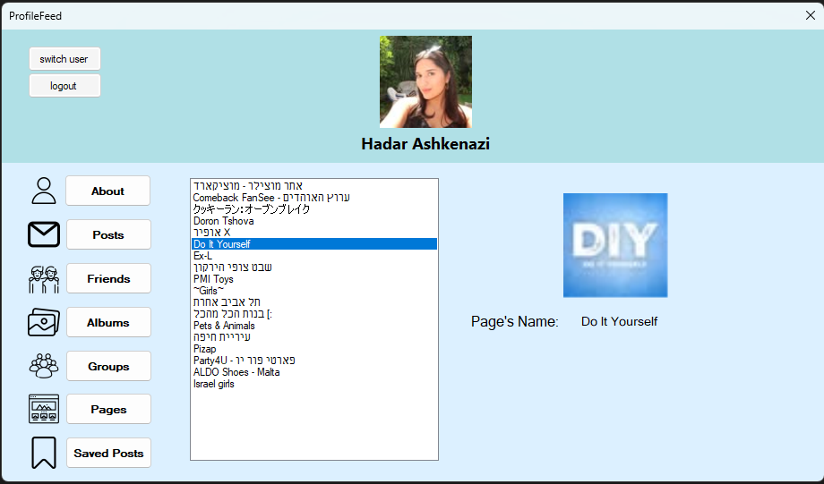
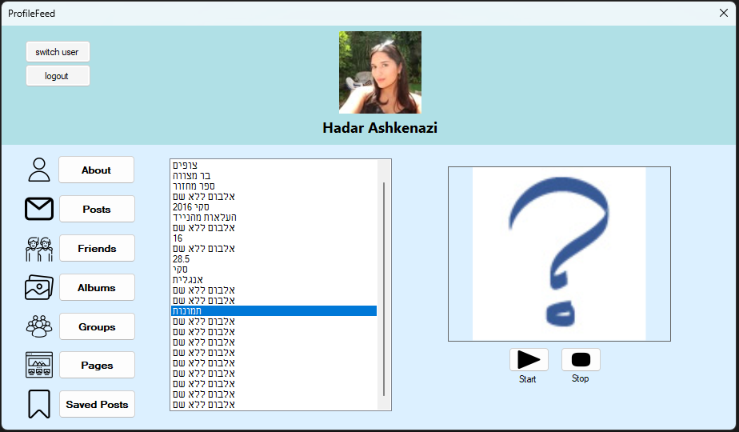

## Facebook Profile Feed (WinForms)

A desktop application built in C# (.NET Framework / WinForms) that integrates with the Facebook Graph API to display and manage user profile data.
The project focuses on clean OOP design and implementation of design patterns in a real-world-like application.

### Key Features
- Facebook login and profile data retrieval
- Multiple profile sections: Posts, Albums, Friends, Groups, Pages, About
- Album slideshow with dynamic image display
- Save and manage favorite posts
- Dynamic UI updates based on user interactions
- Error handling for missing or unavailable data

### Project Highlights
- Integration with an external API
- Event-driven WinForms application
- Clear separation between UI and logic
- Modular and extensible architecture
- Use of design patterns (Strategy, Observer, Factory, Template Method, Adapter)
- Emphasis on maintainable and scalable code structure

### Screenshots

**Pages section**

**Albums slideshow**

